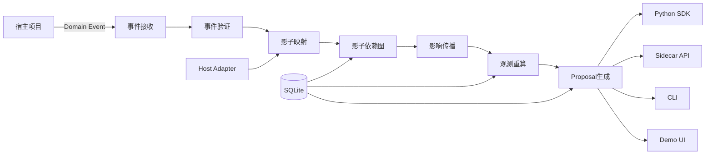

# Temporal Impact
## 可嵌入式动态影响分析引擎——Codex 开发文档

> 推荐仓库名：`temporal-impact`  
> 首个版本：`v0.1.0-alpha`  
> Python：3.12+  
> 推荐许可证：Apache-2.0  
> 建议保存位置：`docs/DEVELOPMENT.md`

---

# 1. 项目定位

Temporal Impact 是一个**可嵌入现有项目的、事件驱动的动态影响分析引擎**。

它监听宿主系统中的变化事件，维护一个版本感知的影子依赖图，只重新计算真正受到影响的结果，并输出可解释的处理建议，而不会替代宿主项目原有的数据、任务系统和业务逻辑。

英文描述：

> An embeddable, event-driven impact analysis engine for evolving applications.

v0.1 只承诺：

> 接收一次变化，找到可能受到影响的对象，计算影响强度，并解释完整传播路径。

它不是小说自动续写软件、Agent 平台、图数据库、工作流调度器，也不会自动修改宿主项目。

---

# 2. 最终产品形态

项目由五部分组成：

```text
Temporal Impact
├── Python SDK
├── CLI
├── Sidecar HTTP API
├── Demo UI
└── Adapter Protocol
```

## 2.1 Python SDK

```bash
pip install temporal-impact
```

```python
from temporal_impact import ImpactEngine, ChangeEvent

engine = ImpactEngine()

report = engine.analyze(
    ChangeEvent(
        event_id="evt-001",
        event_type="object.updated",
        source="example-app",
        project_id="project-001",
        branch_id="main",
        object_type="character",
        object_id="master",
        before={"status": "dead"},
        after={"status": "hidden_alive"},
    )
)

print(report.impacts)
```

## 2.2 CLI

```bash
temporal-impact init
temporal-impact ingest event.json
temporal-impact analyze event.json
temporal-impact demo
temporal-impact serve
```

## 2.3 Sidecar 服务

```bash
temporal-impact serve
```

默认：

```text
http://127.0.0.1:8765
```

非 Python 项目只需要向它发送 JSON 事件。

## 2.4 Demo UI

```bash
temporal-impact demo
```

浏览器打开：

```text
http://localhost:8501
```

## 2.5 Adapter Protocol

```python
from abc import ABC, abstractmethod
from typing import Any

class HostAdapter(ABC):

    @abstractmethod
    def get_object(
        self,
        object_type: str,
        object_id: str
    ) -> dict[str, Any]:
        """读取宿主项目中的真实对象。"""

    @abstractmethod
    def list_relations(
        self,
        object_type: str,
        object_id: str
    ) -> list[dict[str, Any]]:
        """读取该对象的宿主关系。"""

    def apply_proposal(
        self,
        proposal: dict[str, Any]
    ) -> None:
        """用户确认后，可选地将建议交回宿主项目。"""
        raise NotImplementedError
```

---

# 3. 关键设计原则

## 3.1 宿主项目是唯一事实来源

Temporal Impact 不保存第二份完整业务数据。

```text
宿主项目：保存真实章节、代码、论文或业务对象
Temporal Impact：保存引用、摘要、哈希、关系、观测值和建议
```

## 3.2 使用影子对象

```json
{
  "shadow_id": "plotpilot:chapter:10",
  "source_system": "plotpilot",
  "source_type": "chapter",
  "source_id": "10",
  "source_revision": "8",
  "fingerprint": "a6f4e9",
  "summary": "第10章师父被宣布死亡",
  "analysis_status": "valid"
}
```

影子对象不保存完整正文，只保存分析所需信息。

## 3.3 默认只读

```text
观察 → 分析 → 输出 Proposal
```

v0.1 不自动回写宿主系统。

## 3.4 不强制依赖 AI

没有 API Key、Neo4j、Redis 或云服务时，核心算法仍必须正常运行。

## 3.5 所有影响必须可解释

不能只返回分数，必须显示：

```text
师父状态变化
→ 主角复仇动机依赖旧状态
→ 第20章高潮依赖复仇动机
→ 第20章被标记为高度影响
```


# 4. 总体架构



---

# 5. 推荐仓库结构

```text
temporal-impact/
├── README.md
├── LICENSE
├── CHANGELOG.md
├── CONTRIBUTING.md
├── CODE_OF_CONDUCT.md
├── SECURITY.md
├── AGENTS.md
├── pyproject.toml
├── src/
│   └── temporal_impact/
│       ├── __init__.py
│       ├── config.py
│       ├── events/
│       ├── shadow/
│       ├── graph/
│       ├── impact/
│       ├── observations/
│       ├── proposals/
│       ├── adapters/
│       ├── storage/
│       ├── api/
│       ├── cli/
│       └── demo/
├── examples/
│   ├── basic_python/
│   ├── generic_webhook/
│   ├── novel_adapter/
│   ├── software_change/
│   └── research_change/
├── docs/
│   ├── DEVELOPMENT.md
│   ├── EVENT_SCHEMA.md
│   ├── ADAPTER_GUIDE.md
│   ├── ALGORITHM.md
│   ├── INTEGRATION_GUIDE.md
│   └── ROADMAP.md
├── tests/
│   ├── unit/
│   ├── integration/
│   └── end_to_end/
└── .github/
    └── workflows/
        ├── tests.yml
        └── release.yml
```

---

# 6. 标准事件协议

## 6.1 最小事件

```json
{
  "event_id": "evt-01J001",
  "event_type": "object.updated",
  "source": "plotpilot",
  "project_id": "novel-001",
  "branch_id": "main",
  "object": {
    "type": "character",
    "id": "master",
    "revision": "8"
  },
  "before": {
    "real_status": "dead"
  },
  "after": {
    "real_status": "hidden_alive"
  },
  "occurred_at": "2026-07-15T10:30:00+09:00",
  "metadata": {
    "reason": "作者修改设定"
  }
}
```

## 6.2 v0.1 事件类型

```text
object.created
object.updated
object.deleted
relation.changed
task.completed
```

## 6.3 Pydantic 模型

```python
from datetime import datetime
from typing import Any
from pydantic import BaseModel, Field

class ObjectRef(BaseModel):
    type: str
    id: str
    revision: str | None = None

class ChangeEvent(BaseModel):
    event_id: str
    event_type: str
    source: str
    project_id: str
    branch_id: str = "main"
    object: ObjectRef
    before: dict[str, Any] | None = None
    after: dict[str, Any] | None = None
    occurred_at: datetime
    metadata: dict[str, Any] = Field(default_factory=dict)
```

同一个 `event_id` 重复提交时，不得重复生成报告或 Proposal。


# 7. 影子图模型

## 7.1 ShadowNode

```python
class ShadowNode:
    id: str
    project_id: str
    branch_id: str
    source_system: str
    source_type: str
    source_id: str
    source_revision: str | None
    fingerprint: str | None
    summary: str | None
    importance: float
    status: str
```

状态：

```text
valid
possibly_affected
conflict
stale
discarded
locked
```

## 7.2 ShadowRelation

```python
class ShadowRelation:
    id: str
    project_id: str
    branch_id: str
    source_node_id: str
    target_node_id: str
    relation_type: str
    weight: float
    confidence: float
    status: str
    evidence: dict | None
```

## 7.3 v0.1 关系类型和默认权重

| 关系 | 默认权重 |
|---|---:|
| conflicts_with | 1.00 |
| causes | 0.90 |
| depends_on | 0.85 |
| supports | 0.75 |
| references | 0.55 |
| appears_in | 0.40 |
| contains | 0.30 |

---

# 8. 影响传播算法

使用：

```text
受限 BFS
+ 关系权重
+ 距离衰减
+ 节点重要度
+ 关系置信度
```

公式：

```text
ImpactScore
=
ChangeStrength
× RelationWeight
× DistanceDecay
× TargetImportance
× Confidence
```

距离衰减：

| 深度 | 衰减 |
|---:|---:|
| 1 | 1.00 |
| 2 | 0.75 |
| 3 | 0.56 |
| 4+ | 停止传播 |

影响等级：

```python
def classify_impact(score: float) -> str:
    if score >= 0.85:
        return "conflict"
    if score >= 0.65:
        return "high"
    if score >= 0.40:
        return "medium"
    return "low"
```

结果模型：

```python
class ImpactResult:
    target_node_id: str
    score: float
    level: str
    distance: int
    path: list[dict]
    reason: str | None
```

必须测试：

```text
图中存在环
同一目标多条路径
无关系节点
已失效关系
目标被锁定
超过最大深度
重复事件
```

---

# 9. 动态观测值

v0.1 包含：

```text
conflict_score
staleness_score
stability_score
```

## 9.1 conflict_score

目标对象与当前变化之间的冲突程度，范围 0—1。

## 9.2 staleness_score

```text
失效依赖权重总和
÷
全部依赖权重总和
```

## 9.3 stability_score

```text
1
-
(
冲突权重
+
过期权重
+
未确认高风险权重
)
÷
关键节点总权重
```

## 9.4 增量重算

```text
变化节点
→ 查找依赖观测
→ 标记 dirty
→ 只重算 dirty 观测
→ 未受影响结果继续复用
```

---

# 10. Proposal 系统

Proposal 是建议，不是正式业务修改。

v0.1 类型：

```text
review_required
mark_stale
create_revision_task
branch_recommended
recalculate_required
```

模型：

```python
class Proposal:
    id: str
    project_id: str
    branch_id: str
    source_event_id: str
    target_object_type: str
    target_object_id: str
    proposal_type: str
    priority: float
    reason: str
    evidence: list[dict]
    status: str
```

状态：

```text
pending
accepted
rejected
applied
obsolete
```


# 11. SDK、API 与 CLI

## 11.1 SDK 公开接口

```python
from temporal_impact import (
    ImpactEngine,
    ChangeEvent,
    ShadowNode,
    ShadowRelation,
    ImpactReport,
)
```

```python
engine = ImpactEngine(
    database_url="sqlite:///temporal_impact.db",
    max_depth=3,
    default_branch="main",
)
```

公共方法：

```text
register_node
register_relation
ingest
analyze
get_report
list_proposals
```

## 11.2 Sidecar API

```text
GET  /health
POST /events
POST /analyze
GET  /reports/{report_id}
GET  /projects/{project_id}/graph
GET  /projects/{project_id}/proposals
POST /proposals/{proposal_id}/accept
```

v0.1 接受 Proposal 只更新本地状态，不自动回写宿主。

## 11.3 CLI

建议使用 Typer：

```bash
temporal-impact --help
temporal-impact init
temporal-impact ingest event.json
temporal-impact analyze event.json
temporal-impact graph
temporal-impact proposals
temporal-impact serve
temporal-impact demo
```

---

# 12. Demo UI

使用 Streamlit，包含：

```text
Overview
Event Timeline
Shadow Graph
Impact Report
Observations
Proposals
```

内置小说演示：

```text
师父死亡
→ 师父假死并幕后操纵
```

固定预期：

```text
第12章 conflict_score：0.12 → 0.94
第20章 staleness_score：0.08 → 0.86
整体 stability_score：0.84 → 0.51
```

这些数值使用固定演示参数，不依赖 AI。

---

# 13. 三个示例

## 13.1 小说

```text
师父死亡 → 师父假死
```

## 13.2 软件开发

```text
删除 API 字段 currency
```

输出：

```text
前端类型过期
测试需要重跑
文档过期
旧客户端可能不兼容
```

## 13.3 论文

```text
样本年份 2015—2024 → 2018—2024
```

输出：

```text
描述性统计过期
回归表过期
摘要数字需要检查
结论可能受影响
```

三个示例必须使用同一核心 SDK。

---

# 14. 存储与配置

v0.1 使用 SQLite。

表：

```text
events
shadow_nodes
shadow_relations
impact_reports
impact_results
observation_values
observation_dependencies
proposals
```

默认数据库：

```text
~/.temporal-impact/temporal_impact.db
```

环境变量：

```text
TEMPORAL_IMPACT_DB_URL
TEMPORAL_IMPACT_HOST
TEMPORAL_IMPACT_PORT
TEMPORAL_IMPACT_LOG_LEVEL
TEMPORAL_IMPACT_MAX_DEPTH
```


# 15. 测试要求

## 单元测试

```text
事件验证
幂等性
关系权重
距离衰减
影响分数
影响等级
环检测
多路径
观测重算
Proposal 去重
```

## 集成测试

```text
注册节点
→ 注册关系
→ 提交事件
→ 生成影响报告
→ 更新观测值
→ 生成 Proposal
```

## 端到端测试

```text
师父死亡
→ 师父假死
→ 第12章冲突度上升
→ 第20章过期度上升
→ 稳定度下降
→ Proposal 生成
```

原则：

```text
不调用真实 AI
使用临时 SQLite
测试互相隔离
不依赖执行顺序
不得隐藏失败
```

---

# 16. GitHub 发布要求

README 首页顺序：

```text
一句话介绍
快速安装
最小代码示例
师父假死效果
核心能力
接入方式
文档链接
```

快速体验：

```bash
git clone https://github.com/<owner>/temporal-impact.git
cd temporal-impact
pip install -e .
temporal-impact demo
```

GitHub Actions 至少执行：

```text
Python 3.12
Python 3.13
ruff
mypy
pytest
构建 wheel
```

首个版本：

```text
v0.1.0-alpha
```

---

# 17. v0.1 范围

## 必须完成

```text
标准事件协议
影子节点和关系
SQLite
BFS 传播
完整传播路径
三个观测值
Proposal
SDK
CLI
Sidecar API
Demo UI
三个示例
测试
README
GitHub Actions
```

## 明确不做

```text
自动修改宿主项目
自动写小说
分支合并
Neo4j
Temporal
LangGraph
Graphiti
Salsa
Redis
用户登录
云端账号
多人协作
四维球体
强制 AI
```


# 18. Codex 分阶段 Goal

每个 Goal 独立完成、测试、验收并停止。

## Goal 00：仓库初始化

```text
请阅读 AGENTS.md 和 docs/DEVELOPMENT.md。

本次只初始化仓库，不实现业务逻辑。

完成：
1. 标准 src 布局；
2. pyproject.toml；
3. Python 3.12+；
4. 运行依赖：pydantic、networkx、sqlmodel、typer、fastapi、uvicorn、streamlit；
5. 开发依赖：pytest、pytest-cov、ruff、mypy、httpx；
6. README、LICENSE、CHANGELOG、CONTRIBUTING、SECURITY；
7. tests 目录；
8. GitHub Actions；
9. 最小导入测试；
10. 运行 pytest、ruff、mypy；
11. 不执行 git push；
12. 完成后停止。
```

验收：

```text
pip install -e . 成功
pytest 通过
ruff 通过
包可以 import
```

## Goal 01：事件协议

```text
本次只实现 ChangeEvent。

完成：
1. ObjectRef；
2. ChangeEvent；
3. 五种事件类型；
4. JSON 读写；
5. 时区验证；
6. event_id 幂等；
7. CLI ingest；
8. 测试；
9. 不实现图和传播；
10. 完成后停止。
```

## Goal 02：SQLite 与影子对象

```text
本次只实现 SQLite、ShadowNode 和 ShadowRelation。

完成：
1. 数据库配置；
2. 可重复初始化；
3. 数据模型；
4. Repository；
5. CRUD；
6. 不保存完整正文；
7. 测试；
8. 完成后停止。
```

## Goal 03：Adapter 与图构建

```text
本次只实现 HostAdapter、MemoryAdapter、ShadowMapper 和 NetworkX 图。

完成：
1. 从 Adapter 同步对象；
2. 同步关系；
3. 建图；
4. 保留宿主引用；
5. 测试；
6. 不实现影响传播；
7. 完成后停止。
```

## Goal 04：影响传播

```text
本次只实现可解释 BFS。

完成：
1. 最大深度 3；
2. 权重、衰减、重要度、置信度；
3. 环处理；
4. 多路径；
5. 完整路径；
6. ImpactResult；
7. CLI analyze；
8. 测试；
9. 不实现观测；
10. 完成后停止。
```

## Goal 05：观测引擎

```text
本次只实现 conflict_score、staleness_score、stability_score。

完成：
1. ObservationValue；
2. ObservationDependency；
3. dirty 标记；
4. 局部重算；
5. 前后值保存；
6. 测试；
7. 完成后停止。
```

## Goal 06：Proposal 引擎

```text
本次只实现 Proposal。

完成：
1. 五种 Proposal 类型；
2. 生成规则；
3. 去重；
4. 失效；
5. 状态流转；
6. 不回写宿主；
7. 测试；
8. 完成后停止。
```

## Goal 07：Python SDK

```text
本次只整理公开 SDK。

完成：
1. ImpactEngine；
2. register_node；
3. register_relation；
4. ingest；
5. analyze；
6. get_report；
7. list_proposals；
8. basic_python 示例；
9. SDK 测试；
10. 完成后停止。
```

## Goal 08：Sidecar API

```text
本次只实现 FastAPI 服务。

完成：
1. /health；
2. /events；
3. /analyze；
4. /reports/{id}；
5. /graph；
6. /proposals；
7. OpenAPI；
8. 统一错误；
9. API 测试；
10. 不做认证和云部署；
11. 完成后停止。
```

## Goal 09：CLI

```text
本次完善 Typer CLI。

完成：
init、ingest、analyze、graph、proposals、serve、demo、--help。
添加 CLI 测试，完成后停止。
```

## Goal 10：Demo UI

```text
本次只实现 Streamlit Demo。

完成：
Overview、Timeline、Graph、Impact、Observations、Proposals；
内置师父假死演示；
一键重置；
不调用真实 AI；
完成后停止。
```

## Goal 11：三个示例

```text
本次只增加小说、软件开发、论文三个示例。

三个示例必须使用同一 SDK；
每个示例有 README、数据和端到端测试；
不得增加领域专用核心类；
完成后停止。
```

## Goal 12：文档与发布准备

```text
本次只完善 README 和开源文档。

完成：
EVENT_SCHEMA.md
ADAPTER_GUIDE.md
ALGORITHM.md
INTEGRATION_GUIDE.md
全新环境安装测试
链接检查
不新增功能
完成后停止。
```

## Goal 13：v0.1 验收

```text
本次不新增功能，只验收：

pip install -e .
pytest
ruff
mypy
CLI
API
Demo
三个示例
事件幂等
环和多路径
SQLite 持久化
Proposal 去重
README 快速启动

只修复阻塞发布的问题。
生成 docs/RELEASE_CHECKLIST.md。
不执行 git push。
完成后停止。
```


# 19. Codex 通用模板

```text
请先阅读：

- AGENTS.md
- docs/DEVELOPMENT.md
- 当前 Goal 相关代码和测试

本次 Goal 只实现：

[目标]

允许修改：

[模块]

禁止：

- 不实现下一 Goal；
- 不重构无关代码；
- 不执行 git push；
- 不隐藏失败测试；
- 不删除用户已有代码。

完成要求：

1. 实现功能；
2. 添加测试；
3. 运行相关测试；
4. 运行完整测试；
5. 报告修改文件；
6. 报告测试命令和结果；
7. 对照验收标准逐项检查；
8. 报告已知限制；
9. 完成后停止。
```

---

# 20. v0.1 最终验收

```text
[ ] pip install -e . 成功
[ ] temporal-impact --help 成功
[ ] temporal-impact demo 成功
[ ] temporal-impact serve 成功
[ ] 师父假死演示成功
[ ] 软件开发示例成功
[ ] 论文示例成功
[ ] 重复事件不重复处理
[ ] 图中存在环时不死循环
[ ] 影响报告显示完整路径
[ ] 观测值动态变化
[ ] Proposal 不直接改宿主
[ ] SQLite 重启后数据保留
[ ] pytest 全部通过
[ ] ruff 通过
[ ] mypy 通过
[ ] GitHub Actions 通过
[ ] README 10 分钟内可跑通
```

---

# 21. 后续路线

## v0.2

```text
Webhook 签名
批量事件
关系导入
更完善的 Adapter
报告导出
```

## v0.3

```text
分支命名空间
事件有效时间
历史查询
快照
```

## v0.4

```text
可选 AI 关系提取
语义冲突判断
AI Proposal
```

## v0.5

```text
时空切片
上下文预算
领域插件
```

## v1.0

```text
稳定 SDK
稳定事件协议
稳定 Adapter API
向后兼容策略
正式 PyPI 发布
```

---

# 22. 最终原则

项目必须保持：

```text
容易安装
容易演示
容易嵌入
默认只读
输出可解释
不替代宿主系统
```

v0.1 最重要的成功标准：

> 一个陌生开发者能在 10 分钟内启动 Demo，并在 30 分钟内通过一个 JSON 事件接入自己的项目。
